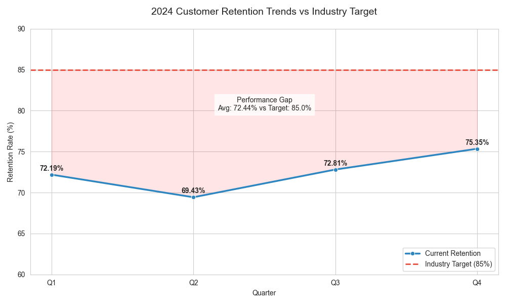

# Data Story: E-commerce Customer Retention Analysis 2024

## Executive Summary
This analysis reviews the quarterly customer retention performance for the fiscal year 2024. Despite a recovery in Q4, the company remains significantly below the industry benchmark, requiring immediate strategic intervention.

**Analyst Email:** 23f1002246@ds.study.iitm.ac.in

## Key Findings

### 1. The Performance Gap
*   **Current Status:** The average customer retention rate for 2024 is **72.44**.
*   **The Goal:** The industry benchmark target is **85**.
*   **The Gap:** We are currently underperforming by approximately 12.56 percentage points.

### 2. Quarterly Volatility
The data reveals a concerning dip in mid-year performance:
*   **Q1 (72.19):** Started below target.
*   **Q2 (69.43):** Dropped significantly, marking the lowest point of the year.
*   **Q3 (72.81) & Q4 (75.35):** Showed signs of recovery, with Q4 being the strongest quarter.

*Note: The red shaded area in the chart above visualizes the missed opportunity gap between our performance and the industry standard.*

## Business Implications
The failure to meet the 85% target suggests that customers are churning faster than the industry average. This has several negative impacts:
1.  **Increased Acquisition Costs:** We must spend more on marketing to replace lost customers.
2.  **Reduced LTV:** Lower retention directly correlates to lower Customer Lifetime Value.
3.  **Market Position:** Competitors hitting the 85% benchmark are growing their user base faster and more efficiently.

## Recommendations & Solution
While the Q4 upward trend is promising, organic growth is insufficient to close the gap to 85%. 

To bridge this gap effectively, we must **implement targeted retention campaigns**.

**Specific Actions:**
1.  **Analyze Q2 Drop-off:** Investigate the specific causes for the Q2 dip (69.43) to prevent recurrence.
2.  **Loyalty Incentives:** Launch a rewards program specifically for customers entering their 3rd month (the typical churn point).
3.  **Personalized Outreach:** Use the Q4 momentum to re-engage users with personalized offers based on purchase history.

---
*Analysis generated with the assistance of LLM tools for Data Storytelling.*
